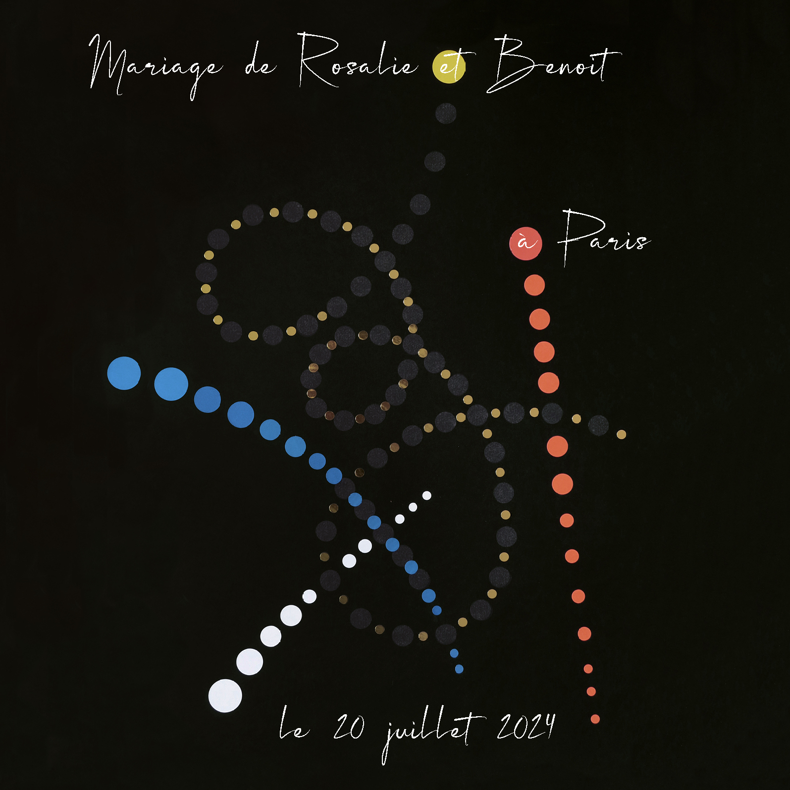

Title: Samstagsprogramm
Date: 2010-12-04 10:20
lang: de
slug: programme-samedi

Programm | Zeit | Ort
--- |--- | ---
Religiöse Zeremonie | 15:30 Uhr | Saint Jean-Baptiste de Belleville 139 Rue de Belleville, 75019 Paris ([Karte](https://www.google.com/maps/place/%C3%89glise+Saint-Jean-Baptiste +de+Belleville/@48.8756903,2.3867071,17z/data=!3m1!4b1!4m6!3m5!1s0x47e66dea9e35b2c7:0x80f4e2e8e5fd9ca1!8m2!3d48.8756903!4d2.389282!16s% 2Fg%2F120vzky8?entry=ttu))
Fotoshooting (Brautpaar) | 17 Uhr | Parc des Buttes-Chaumont 75019 Paris
Empfang | 18 Uhr | Galerie SETZE / LEPARTKING 36 rue Miguel Hidalgo, 75019 Paris ([Karte](https://www.google.com/maps/place/36+Rue+Miguel+Hidalgo,+75019+Paris /@48.8815654,2.3889276,17z/data=!3m1!4b1!4m6!3m5!1s0x47e66dc75f99238f:0x70580508f1d9bc96!8m2!3d48.8815654!4d2.3915025!16s%2Fg% 2F11c29p3102?entry=ttu))

 
 

## Religiöse Zeremonie – 15:30 Uhr

> In der Kirche Saint Jean-Baptiste de Belleville, 139 Rue de Belleville, 75019 Paris ([Karte](https://www.google.com/maps/place/%C3%89glise+Saint-Jean-Baptiste +de+Belleville/@48.8756903,2.3867071,17z/data=!3m1!4b1!4m6!3m5!1s0x47e66dea9e35b2c7:0x80f4e2e8e5fd9ca1!8m2!3d48.8756903!4d2.389282!16s% 2Fg%2F120vzky8?entry=ttu))

Wir erwarten Sie nur einen Steinwurf vom Bahnhof Jourdain (Linie 11) entfernt zu einem der Höhepunkte des Tages, unserer Vereinigung vor Gott.

## Fotoshooting (Brautpaar) – 17:00 Uhr

Neue Fotosession am Nachmittag zur Vervollständigung der Morgenserie.

## Empfang – 18:00 Uhr

> In der Kunstgalerie SETZE / LEPARTKING, 36 rue Miguel Hidalgo, 75019 Paris ([Karte](https://www.google.com/maps/place/36+Rue+Miguel+Hidalgo,+75019+Paris/@48.8815654,2.3889276,17z/data=!3m1!4b1!4m6!3m5!1s0x47e66dc75f99238f:0x70580508f1d9bc96!8m2!3d48.8815654!4d2.3915025!16s%2Fg%2F11c29p3102?entry=ttu))

Der Tag endet in der SETZE / LEPARTKING Art Gallery mit einem Cocktail-Dinner und einem wilden Tanzabend. Neben anderen Aktivitäten werden wir die großartige Gelegenheit haben, einige Werke aus der Galerie sowie einige Werke unserer lieben Künstlerfreundin Toni Blue Caro auszustellen!

 
 

